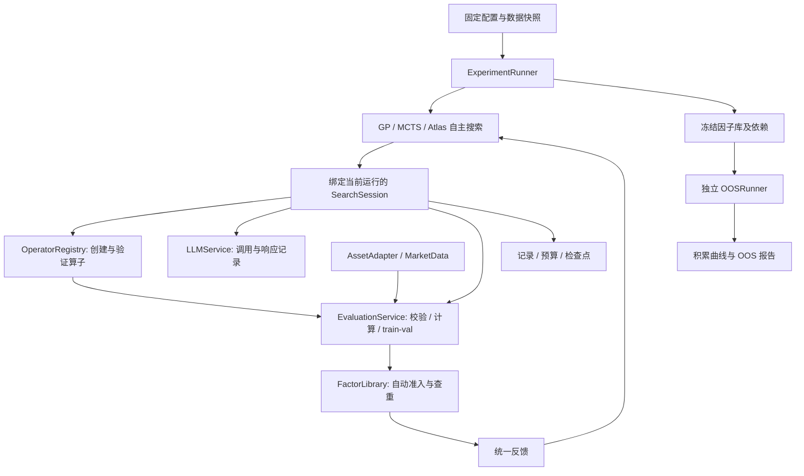

# Alpha Atlas V1 施工计划

更新日期：2026-09-09。本文保留整体目标设计；本轮已实现范围与后续工作以第 12 节为准。
本轮为 60 个基础算子、组合/group_batch 注册、文件因子库及冻结 OOS。
具体接口和数值语义见 [DSL 文档](docs/dsl.md)。数据验收见
[docs/data_snapshot.md](docs/data_snapshot.md)。

方法复现与对比统一遵循 [复现规范](docs/method_reproduction.md)，
MCTS-LLM 的模块归属、源码差异与实施顺序见 [专项方案](docs/mcts_llm.md)。
MCTS-LLM 已完成五维算法适配与模拟模型验证；具体边界见专项说明，尚未验证真实模型效果。

## 1. 目标与范围

在固定数据快照和 train/val 区间内，把语义假设、计算表达式、因子观测及探索证据组织起来，
比较 GP、MCTS、Alpha Atlas 等方法能否以有限预算更快积累合格、非冗余的因子，
并在搜索结束后独立检验冻结因子库的 OOS 表现。

核心边界：**方法决定探索什么、怎样继续；公共平台决定怎么算、是否入库、
消耗多少资源、如何记录和比较。**

- 多资产共用协议与执行基础；字段、时钟、标的、算子约束和指标含义按资产配置。
- 各方法不仅可以构造表达式，也能通过相同工具创建自定义算子。
- Atlas 用地图判断最值得探索的区域；未知区域可以由 AI 提出假设，不预设其中必有 alpha。
- 自动入库只操作本次实验因子库，不触发生产接受、全量物化、部署或交易。
- V1 暂不实现动态市场状态、因子有效性推演、实时交易或组合择时。
- 首版 OOS 报告以冻结因子库的 IC 为主；成本后组合收益等另行扩展，不能用 IC 冒充。

## 2. 数据与实验隔离

### 2.1 固定资产

请求区间为 2015-01-01 至 2026-09-01，端点包含；数据文件独立存放在 `data/`，
交换格式为 `.parq`。两类资产均重新从 RiceQuant 获取。

| 资产 | 观测与范围 | 字段基础与边界 |
| --- | --- | --- |
| A 股 | 日频；历史 HS300、ZZ500、ZZ1000 逐日并集，可选择各子池 | 价量、40 个财务／估值字段、财报版本、复权、ST／停牌、历史成员 |
| 期货 | 全品种逐日主力真实合约，原生 5m | OHLC、成交量、成交额、持仓量、合约元数据与主力映射 |

AlphaAtlas 使用已确认的 RQ 原生 **5m** 数据，不套用 ChaoticTrader 的 canonical 1m 约束，
也不改动其 research/live 数据库。原 AlphaSeeker 导出仅为参考，不是活动数据源。

- 时间统一为 Asia/Shanghai，Bar 时间代表结束时刻；夜盘保留供应商交易日。
- 股票使用逐日成员，保留入选前的历史预热数据；ST、停牌和异常行情按固定规则排除评分。
- 股票财务日指标延后一交易日使用，保留来源日和原始财报版本，不向过去填入未来公告。
- 股票研究价格口径、期货真实合约未复权口径明确写入配置。
- 标的身份为 `(exchange, instrument_id)`，`product` 仅作聚合。
- 期货滚动与标签不能跨真实合约；当前不补充非主力时期历史，窗口不足产生空值。
- 当前主力数据不支持完整跨月价差、期限结构和现货基差；补充对应数据后才能开放。
- 保留原始空值和源数据例外；质量隔离与数据覆盖规则对所有方法一致。

### 2.2 固定 fold

| Fold | Train | Val | OOS |
| --- | --- | --- | --- |
| fold1 | 2016-01-01—2018-12-31 | 2019-01-01—2020-12-31 | 2021-01-01—2022-12-31 |
| fold2 | 2019-01-01—2021-12-31 | 2022-01-01—2023-12-31 | 2024-01-01—2025-12-31 |

fold2 的训练期完整包含 2019—2021 年。
每个 fold 用训练起点前一个自然年作预热：fold1 为 2015 年、fold2 为 2018 年。
2026 年数据预留。标签终点必须位于当前 split 内。

每个 `asset × universe × fold × method × seed` 独立运行，从空因子库开始。
每次新运行生成 `run_id`，检查点恢复沿用原 `run_id`。

各运行共享固定原始数据和基础工具，不共享新增因子、方法状态、地图、LLM 响应或评估缓存。
fold1 与 fold2 不构成接力实验，也不传递调参或选择结果；分别报告。
日期重叠意味着二者不是统计上独立的样本，报告不得据此夸大独立验证次数。

## 3. 整体架构



这些首先是单个 Python 项目内的模块，不要求拆成独立网络服务。
V1 单运行单写者、同步执行；代码算子的受限子进程是计算隔离，不引入分布式任务队列。

## 4. 公共对象与身份

| 对象 | 最小内容 | 说明 |
| --- | --- | --- |
| `ExperimentSpec` | 资产／股票池、快照、fold、方法及参数、seed、空间配置、评估／入库规则、预算 | 启动时保存完整解析后的配置副本与哈希，运行中不修改 |
| `AssetProfile` | 适配器、频率／日历、字段／单位、价格口径、标的身份、能力限制、目标及指标 | 新增资产主要通过配置与适配器完成 |
| `Candidate` | `expression`、可选 `name`、可选 `metadata` | GP、MCTS 不需要大陆／区域信息即可评估；不设 `submission_id` |
| `CompiledFactor` | `factor_id`、计算计划、依赖版本、字段和历史需求 | 名称、区域、生成祖先不参与计算身份 |
| `FactorObservation` | `factor_id`、`snapshot_id`、`row_id + value` | 内部观测；通过快照内行索引映射回时间与具体标的 |
| `Metric` | 名称、split、值、有效样本量、聚合口径 | 缺失／不可定义用 null，不能用零代替 |
| `EvaluationResult` | 状态、train/val 指标、覆盖率、训练方向、失败原因、观测引用、成本 | 不包含 OOS；观测引用为受控引用，不暴露任意数据文件路径 |
| `TrialFeedback` | `trial_index`、可空 `factor_id`、评估结果、入库结果、最近邻、成本和剩余预算 | 每个提交位置均有反馈，包括失败、重复与预算拒绝 |
| `LibraryView` | 本运行成员、冻结方向、train/val 指标、允许的行为摘要、版本 | 只读，不返回库写入能力或 OOS 信息 |
| `BudgetSnapshot` | 上限、已用／剩余尝试数、实际评估数、时间及适用的 LLM 用量 | 统一口径，不由方法自行汇总 |

配置还需保存代码／未提交源码内容指纹、依赖锁文件、DSL 和基础算子版本。
不建设额外的 policy ID 注册系统：规则正文直接写进配置，哈希用于一致性检查。

三个身份层次分开：

1. 因子定义：规范化计算表达式与实际语义依赖确定 `factor_id`。
2. 因子观测：定义＋数据快照＋股票池／上下文＋预处理口径确定观测身份。
3. 评估结果：观测＋目标＋split＋指标协议确定评估身份。

上下文必须包含横截面股票池、质量规则等影响数值的设置，不能仅凭公式命中缓存。
`row_id` 不是跨快照全球标识；对齐必须同时检查 `snapshot_id`。
平台分配递增 `trial_index`；同表达式的新提交有新 index，恢复同一个未完成步骤沿用旧 index。

## 5. 模块协议与输入输出

### 5.1 SearchMethod 与 SearchSession

```python
class SearchMethod(Protocol):
    def run(self, session: SearchSession) -> None: ...
    def dump_state(self) -> MethodState: ...
    def load_state(self, state: MethodState) -> None: ...


class SearchSession(Protocol):
    def get_context(self) -> SearchContext: ...
    def evaluate(self, candidate: Candidate) -> TrialFeedback: ...
    def evaluate_many(self, candidates: list[Candidate]) -> list[TrialFeedback]: ...
    def get_library(self) -> LibraryView: ...
    def remaining_budget(self) -> BudgetSnapshot: ...
    def register_operator(self, definition: OperatorDefinition) -> OperatorFeedback: ...
    def call_llm(self, request: LLMRequest) -> LLMResult: ...
```

这里是目标接口草图，类型细节施工时落实到 `contracts.py`。
当前 get_context 仅包含资产、频率、目标定义、主指标和剩余预算。日期、fold、运行/快照 ID、
universe 留在平台内部。get_fields/list_operators/get_operator/get_expression_rules 提供专门查询；
算子目录实时反映当前成功注册项，返回独立副本。AlphaProbe 可在既有 JSON 对话中主动查询，
查询记录和恢复复用现有方法状态，最多每阶段 8 轮、每轮 16 项。

单 agent `react` 基线使用相同 ask/tell 和 session，固定系统提示词一次性提供允许字段、
完整算子签名及研究规则。新增只读 `get_evaluation_rules()`；仅开放评估和查询，不创建算子。
模型遇到明确上下文超限才压缩旧循环，系统提示词保持不变；状态和摘要复用现有 checkpoint，
不引入 AgentScope、embedding 或新的哈希。运行与验收协议见 [ReAct 方法](docs/react.md)。


- 方法输入为只含本运行权限的 session，输出主要是候选、算子与方法状态；run 完成后返回。
- 方法自行决定串行、批量、代际和停止条件；公共平台不指定其适应度或奖励公式。
- GP 保存种群／进化状态，MCTS 保存树／节点统计，Atlas 保存地图／假设／探索进度。
- 原 `ask/tell` 方法可用适配器包装进 `run(session)`，无需一次性重写全部搜索器。
- 所有方法均可创建算子、调用同等配置的 LLM 工具；不强制每种方法都使用 LLM。
- session 不提供 OOS、任意文件读取、供应商连接或入库规则修改入口。
- 公共协议隔离适用于受控方法插件，不宣称同一 Python 进程能隔离恶意任意代码。
  AI 生成的代码算子不得因此获得主进程权限，见 6.3。

### 5.2 AssetAdapter / MarketData

输入：`AssetProfile`、数据快照、股票池、字段、截至时间与预热需求。
输出：统一的特征面板、行索引和可用性标记；标签不出现在特征输出中。

统一键至少为 `snapshot_id, row_id, timestamp, trading_day, exchange, instrument_id`。
面板另含获准的数值字段、`eligible` 与质量信息；期货可含用于聚合的 `product`。

- 只有适配器／获取脚本可读供应商与 Parquet；研究组件通过 MarketData 的 DuckDB 边界读取。
- 处理单位、PIT、复权、交易日归属、历史成员、异常隔离和窗口连续性。
- 明确停牌、交易时段切换和同一合约离开主力后再进入时的窗口处理，写入配置和测试。
- 搜索阶段最多加载到 val 结束，OOSRunner 单独申请后续数据；历史预热也遵守权限。
- 标签由评估器从独立路径构建；未来禁止将标签字段混入任意算子输入。

### 5.3 EvaluationService

输入：候选、当前已注册算子、固定数据／目标／评估配置。
输出：`EvaluationResult` 和仅供公共平台使用的观测／缓存引用。

步骤：解析和校验 → 编译身份与依赖 → 因子计算 → 行对齐 → 目标对齐 → train/val 指标。

- 编译失败时 `factor_id=null`；计算失败、覆盖不足、指标不可定义分别记录。
- 因子方向只由 train 决定。train IC 不可定义时拒绝确定方向，不能把 null 当零。
- val 的方向处理使用冻结的训练方向；同时保留原始约定指标与用于准入的指标，标明口径。
- 固定标签边界：目标起点与终点均在评分 split 内，历史预热数据不计分。
- 同一运行可复用确定性计算，缓存键包含实际语义及上下文；所有方法采用相同缓存规则。
- 受控行为摘要只覆盖 train/val，先支持覆盖率、分布及本运行最近邻；原始标签不提供给方法。

初始目标与指标沿用现有资产配置：

| 资产 | 目标 | IC 聚合 |
| --- | --- | --- |
| A 股 | 未来 5 个日 Bar 的复权收盘对数收益 | 逐日横截面 Spearman IC 等权 |
| 期货 | 同一真实合约未来 12 个原生 5m Bar 的收盘对数收益（60m 标签） | 同品种合约样本合并后计算 Pearson 与 Spearman；SQRT 成交额加权 Pearson 为主，其他三项同时报告 |

期货按每个评分 split 的全部 eligible 行统计品种总成交额，再取平方根作为固定权重；
只累加有限非负成交额，不随候选或目标缺失改变。品种 IC 使用共同有限行，至少 5 行，
常数／不可定义品种不参与汇总；零或无有效成交额品种不参与加权汇总。空分母为 null。
期货训练方向、val 准入与方法评分使用加权 Pearson 主指标；四项 val/test IC 沿用同一训练方向。
Pearson 在原始数值上计算线性相关，Spearman 在共同有限行重新排名；二者使用相同聚合权重。
期货命名为 `time_series_{weighted|equal}_{pearson|spearman}_ic`，默认
`time_series_weighted_pearson_ic`。A 股仍以 Spearman 为主，同时报告 Pearson；查重保持 Spearman。
期货控制台仍按两种加权方式分表，Spearman IC、Pearson IC 为最右两列。
正常休市可跨越，因此 12 根 Bar 不保证墙上时钟相隔恰好 60 分钟。旧运行产物保留原口径。

这些是研究标签，不是可执行成交收益；停牌终点、窗口断裂与有效目标规则需在评估配置中明确。
各资产指标含义不同，不能直接混合绝对值排名。

### 5.4 FactorLibrary

输入：成功评估的候选、观测与固定准入规则。
输出：接受／拒绝、原因、最大已比较绝对相关性、最近邻、递增库版本及入库事件。

候选经 session 评估后自动触发准入；方法不调用 `accept()`，库视图只读。

准入顺序：表达式有效 → 计算成功 → train 指标可定义并确定方向 → 覆盖／val 质量门槛
→ 与当前库相关性检查 → 合格则追加。

首批默认沿用现有配置：val 正向 IC ≥ 0.01，val 覆盖率 ≥ 0.8，
绝对 Spearman 相关性 < 0.9，最少 100 个共同有效行；均属可配置研究规则。
不额外要求 train IC 超过一个未定义门槛；若新增门槛，应在所有方法的共同配置中冻结。

- V1 只追加，不替换；同批候选按提交顺序，与本批此前已接受的候选一起查重。
- 首版精确比较 val 上对齐的共同有限值，池化 Spearman；该口径不同于 IC 聚合口径，
  必须在反馈和报告中标注。以后改为按日／品种聚合或抽样时使用新配置。
- 共同样本不足、相关性不可定义和常数因子单独拒绝，不能当成相关性为零。
- 最近邻只指向本运行；若只提前发现一个超过阈值的邻居，不能声称它是全库最近邻。
  首版可完成全库比较得到准确最大值，或明确返回 `comparison_complete=false`。
- 记录准入时的库版本；本轮将评估、准入事件、反馈和版本写入同一个原子 trial JSON，
  提交成功后更新内存。入库成员可从已提交文件重建；已接通同步 ask/tell 检查点恢复。
- 因子定义可以重现其观测，首版不要求所有候选永久全量物化；保留必要缓存和成员引用。

### 5.5 ExperimentRunner

输入：完整配置、新建／恢复模式及方法实现。
输出：运行目录、生命周期状态、完整尝试记录、成本账本、检查点和冻结产物。

负责解析配置、创建隔离环境、装配 session、执行预算、记录方法间计算成本、
收尾、冻结和错误处理。不得调用 OOS 后再继续当前搜索。

当前生命周期：`running → frozen`；中断进入 `interrupted`，一致性检查后可恢复。
运行异常进入 `failed` 并追加 failures.json；写入失败不能静默转为候选质量拒绝。
不可恢复的配置／数据／依赖冲突进入 `failed`，保留证据并要求新运行。
预算耗尽属于正常结束，不把所有后续步骤误记成计算失败。

### 5.6 LLMService

输入：提示词／消息、模型与生成参数、输出约束；仅包含获准的本运行上下文。
输出：响应／解析结果、成功／失败／未知状态、模型标识、用量、费用（可得时）及耗时。

- 统一封装 SDK 调用、输出记录和错误分类，方法不能绕过它调用计费模型。
- 同一比较内固定可用模型、工具权限和预算；提示词策略可属于方法差异，但需保存版本。
- 凭据通过显式配置在受控服务端读取，不复制进仓库、提示词、日志或检查点。
- 请求先记录，结果落盘后再返回方法；已落盘响应在恢复时复用。
- 服务已执行但本地未收到响应的请求标记为 `unknown`；可按统一重试上限重试，
  记录实际新增费用／未知费用，不承诺外部计费 exactly-once。
- V1 不建设完整费用结算系统；未知 token／费用用 null，不用零。

### 5.7 OOSRunner / Reporter

输入：冻结清单、冻结定义／算子／训练方向、匹配的数据与评估配置。
输出：独立 OOS 指标文件、积累曲线和可比较运行的汇总报告。

- 搜索结束、已接受步骤结算完成后，冻结因子库、算子依赖、方向和任何拟合状态。
- 校验冻结内容、配置、数据、代码指纹，使用冻结计划计算；不重新拟合、不重新选择。
- OOS 结果不进入 SearchSession、恢复后的方法状态或当前因子选择逻辑。
- 缓存 OOS 报告也要核对冻结和配置指纹，不能绕过一致性校验。
- 空因子库、无有效 OOS 样本和计算失败明确报告，不静默删除失败成员。
- 当前只输出因子 OOS IC；组合若后续加入，权重、筛选及成本协议须在 OOS 前冻结。

## 6. 可扩展表达式与自定义算子

### 6.1 三层结构

1. 资产基础层：字段、单位、时间、标的身份及数据能力，由平台提供。
2. 基础算子层：共用 DSL／执行器与确定性原语，由平台固定版本。
3. 自定义算子层：方法通过同一入口提出组合定义或受限计算代码，仅在本运行生效。

公平比较固定基础资源、扩展能力和预算，不要求各方法最终得到相同算子集合。
算子注册通过只表示可以使用，既不是因子入库，也不自动新增 Atlas 大陆／区域。

本轮基础空间为 **60 个规范算子**，含 `TS_PROD`、`TS_RANKCORR`、`TS_WINSORIZE`。
分类涵盖算术、条件、缺失处理、历史变化、分布、极值、相关性、事件与截面处理。
精确清单由注册表生成，见 [算子目录](docs/operators.md)，别名不重复计数。
允许递归 AST，不继续把正式实验限制在当前固定五参数模板中。

下列是待施工的起步参数，不是已证明的最优范围；正式实验前统一冻结：

| 项目 | A 股 | 期货 |
| --- | --- | --- |
| 字段 | 价量＋现有 40 个基本面字段 | OHLC、volume、amount、open_interest |
| 四个符号基线自身的候选窗口 | 5、10、20、60、120 个日 Bar | 3、6、12、24、48、96 个 5m Bar |
| 横截面上下文 | 当日有效股票池 | 明确同一时刻可用的品种集合；异质价格比较优先转为标准化量 |
| 复杂度起点 | 最多 20 层算子嵌套、100 个展开后 AST 节点 | 同左 |

常数用有限集合；窗口按 Bar 数解释，不把期货 48 个 Bar 当成固定一个交易日。
平台不设窗口或累计历史上限；窗口为正整数，满足算子最小窗口即可。预热仍从训练起点
前一年加载，但不推导历史预算；日期不暴露给挖掘方法。窗口超过可用历史时输出 null，
不拼合约、不补造数据。代码算子的声明历史必须为非负整数，注册验证和执行超时仍保留。
二元运算输入类型、单位、除零与非法对数、空值传播、最小有效历史统一定义。
加入新数据源／资产基础字段须新建数据快照和实验配置，不能由方法运行中私自读取。

### 6.2 OperatorDefinition / OperatorFeedback

| 对象 | 内容 |
| --- | --- |
| `OperatorDefinition` | 名称／说明，`kind=composite/group_batch`，输入／参数签名，作用域，历史需求，正文、golden 和合成样例 |
| `OperatorFeedback` | 接受／拒绝，可空 `operator_id`，校验错误，测试摘要，耗时，剩余资源预算 |

组合算子正文为已有 DSL 表达式；group_batch 正文为可被 Numba nopython 编译的受限纯函数，golden 为独立 NumPy 实现。
输入是平台传入的数值参数和受控历史窗口／当时横截面，输出是标量或与指定行一一对应的值。
函数不能自行选择其他数据集、目标、未来行或其他运行的状态。

身份与版本：

- 组合算子在编译时展开；相同展开后计算不能因换名称得到新的因子身份。
- 不要求求解任意数学等价；内容规范化去重与行为相关性去重各司其职。
- 代码算子身份包含规范化源码、输入／输出和上下文语义、全部依赖与运行时版本。
- 注册定义不可原地覆盖；修改产生新版本，旧因子继续引用原版本。
- 依赖形成无环图，只引用基础算子或本运行已通过验证的算子。
- 深度、节点和历史需求按组合展开后的依赖检查，禁止靠套一层算子名称绕过限制。

### 6.3 代码算子的执行与验证

按用户确认改为可信本地执行：每次注册先在一个临时子进程中完成 Numba 编译和统一验证，
通过后发布到当前运行；正式求值直接复用本地编译内核，不逐窗口跨进程通信。
只接受 nopython；Float64 只读输入，启用 boundscheck，关闭 fastmath 和并行内核编译。
候选不写 njit 装饰器，平台统一编译；golden 保持独立 NumPy 实现，不调用生产内核。
白名单禁止文件、网络、动态导入、反射和可变全局状态，但不宣称具有操作系统安全隔离。
本地执行可能影响主进程；正式计算预算只能在内核调用之间检查。注册子进程超时则终止。

TS 只接收当前声明窗口且只采纳最后一个输出；CS 只接收同期获准有限截面并返回等长数组。
注册子进程仅接收 JSON 定义和配置，不传入行情/标签文件，不加载候选 pickle 或编译产物。
不再依赖 Docker；旧镜像和运行产物保留。冻结保存源码、方向、参数、依赖及运行环境指纹，
OOS 检查 Python/NumPy/Numba/llvmlite 和平台版本后重新验证注册，旧 Docker 协议不自动迁移。

算子本身为确定性纯计算；学习／拟合型算子留作后续扩展，届时单独规范 fit/transform 与冻结。

注册验证至少包含：

- 语法、输入／输出、依赖与参数边界；缺失、常数、零分母等边界样本。
- 输出形状、行对齐、确定性和有限值／空值处理。
- 提交样例、真实分组执行与历史前缀必须产生有限输出，禁止全 null 空验证。
- 追加／扰动未来数据不改变历史输出的因果性测试。
- 时间序列内核的标的隔离；横截面内核仅访问声明的同期集合。
- 每个候选均验证交易所／合约／连续段隔离、TS 乱序，以及 CS eligible／有限值成员限制。
- 统一性能增长探针：两种窗口／截面规模或固定窗口调用次数，预热后五次内核中位耗时，
  增长相对线性基准超过固定阈值时拒绝；测试阶段、耗时、增长比及失败原因写入注册记录。
- 组合展开后的复杂度、声明历史需求，以及注册超时及本地执行预算。

因果性测试是验证证据，不能替代限制未来数据访问的运行时边界。
注册、测试、失败和实际因子计算的资源消耗统一留痕；注册失败不能悄悄丢弃。

## 7. 预算、批量与反馈规则

### 7.1 最小预算

基础预算为最大候选尝试数；为可扩展算子和 LLM 搜索额外提供统一活动运行时长上限，
启用 LLM 时设置 token／调用额度。算子注册和方法内部建图同样消耗总时间，不能无限免费扩展。
时长由外层 Runner 监督，不能只在下一次 evaluate 时检查；沙箱调用另有单次硬限制。

至少记录：提交位置数、已受理尝试数、独立表达式数、实际评估数、缓存命中数、
算子注册／验证次数、生成／评估／查重耗时、总活动时间、适用的 LLM 用量和费用。
暂停期间不计活动时间；恢复重算、失败调用等实际开销要计入。
未知外部计费不伪装为精确总成本；候选次数、时间与 token 曲线分别报告。

### 7.2 执行语义

- `evaluate_many` 首版按输入顺序同步调用公共评估流程，不按计算完成顺序准入。
- 预算不足接受可受理前缀；其余返回 `budget_rejected` 并记录，不计算、不扣尝试额度。
- 每个新受理候选消耗一次尝试额度，非法表达式、质量拒绝、常数和重复都包含在内。
- 同一表达式的新提交属于新尝试，可命中本运行缓存，但不得再次入库。
- 为返回结果保持与输入列表等长，预算拒绝也分配日志位置；日志位置数不等于已扣预算数。
- 恢复同一已记录步骤不是新提交，复用原 trial 和结算；不另设对外幂等请求机制。
- 批量中断恢复保留原批次顺序及已处理前缀，不能重新排序或再次扣整个批次预算。
- 方法在无预算时应结束；平台停止受理新工作并执行收尾，避免无限提交拒绝请求。

### 7.3 最小反馈结构

```text
trial_index, factor_id?
evaluation_status, train_metrics, val_metrics, direction?, coverage?, failure_reason?
admission_status, admission_reason?, max_abs_corr?, nearest_factors
correlation_scope, comparison_complete, library_version
cache_hit, cost, remaining_budget
```

编译错误、算子未知／不合法、运行超时、计算失败、覆盖不足、质量不足、行为重复、
重叠不足、预算不足分别给出原因。平台返回约定指标，各方法自行定义奖励。
重复候选可以返回缓存指标，并明确 `cache_hit` 与重复入库拒绝，不能混淆计算成功与准入成功。

## 8. 检查点与恢复

第一版只恢复同一个同步 ask/tell 运行，不引入任务队列、事件系统、通用操作调度或调用栈恢复。
Random、GP、MCTS、Atlas 基线实现 dump_state/load_state；其他方法按同一 JSON 协议接入。
状态必须包含全部随机数、参数、种群／树及待反馈位置；tell 不应包含外部副作用。
AlphaPROBE 的 ask 使用现有检查点回调保存三阶段响应、embedding 和批内子代位置；
未落盘的外部调用可能重发，费用记为未知。任意 run(session)、注册过程中断、通用批量
控制流及通用 LLM 请求恢复后续施工。

checkpoint.json 引用原有固定配置指纹，保存已完成 trial、已用尝试预算、库版本、
方法 JSON 状态、待评估候选及 trial_index、已记录活动耗时。不额外计算校验和，不存数据数组、
Numba 机器码或 pickle。run.json 复用现有生命周期字段；异常追加至 failures.json。

持久化顺序：生成候选 → 原子保存待评估检查点 → 计算并提交 trial → tell 消费反馈 →
原子保存新方法状态。只保留当前完整检查点，临时文件替换失败时原文件仍可读取；不承诺
文件系统损坏或突然断电后的持久性。操作系统文件锁防止同一运行被两个进程同时写入。

恢复入口校验配置、源码／锁文件、方法类型、数据快照和运行环境后，重建已提交成员及
已注册算子，再加载方法状态。仅请求 train/val 数据。检查点落后一个已提交 trial 时核对
候选与编号，复用原反馈；未提交则重做，不重复入库或扣预算。tell 中断后从旧状态重放
同一反馈，不能将方法的外部副作用当作可安全重复操作。

成员缓存查重时直接读取，缺失／IPC 无法读取时按需重算并核对原评估，不重新准入。
评估和成员磁盘缓存共用 512 MiB 上限；恢复只统计文件元数据，缺失成员值不在启动时全量重建。
保留原有算子身份和冻结校验，不新增算子记录集合指纹、缓存哈希或重复的方法源码哈希。
不通过新增全文件扫描或每次强制重算替代哈希，也不承诺检测可读缓存的静默数值修改。
冻结文件写齐后才标记 frozen；冻结中断可直接补完。配置冲突拒绝续跑，无检查点旧运行
以及初始化尚未创建检查点的失败不自动迁移。累计时间排除停机等待、包含恢复开销；进程
强制结束后未记录的尾部时间明确标记未知。失败记录无法写入时保留原异常并附加说明。

验收覆盖计算前、trial 提交前后、反馈消费后、检查点替换前后和冻结阶段中断；四个基线
恢复与不中断的候选序列、方法状态、库成员和预算一致。另验证真实进程异常退出后 CLI
恢复、文件锁释放、缓存丢失、写入失败和指纹冲突。AlphaPROBE 专用模型阶段响应复用、
批内子代恢复和 token 用量记录已覆盖；通用外部费用机制属于后续范围。

## 9. Atlas 地图协议

地图属于 Atlas 的内部方法状态，引用公共 trial／factor／operator ID，
不另建评分器或独立接受标准。GP、MCTS 可以不使用语义对象。

| 元数据对象 | 内容 |
| --- | --- |
| `Continent` | 机制说明、稳定 ID、分类版本与来源 |
| `Region` | 所属大陆、新假设、约束、来源、证据状态；允许没有因子 |
| `FactorDescriptor` | 公共因子 ID、计算结构／依赖、语义归属、可用行为摘要 |
| `ClassificationProposal` | 新大陆／区域／归属建议及支持证据，初始为待验证 |
| `ExplorationRecord` | 探索方向、相关试验／算子、结果、重复性和消耗 |

语义可由 AI 提出，结构和行为提供佐证。V1 允许记录提案和版本化修改，
暂不建设复杂分类审批体系；证据不足保持待验证状态。
分类是否新增不影响候选能否评估，也不直接决定因子能否入库。

导航使用成功、失败、重复、覆盖和成本证据；算子创新也可作为探索经验。
Atlas 自建区域数量不能直接当作有效世界地图扩大面积。
若报告覆盖增量，需独立于方法，使用预先固定的语义评价或统一行为聚类规则；
无法完成这项评价时先报告非冗余因子增长，不伪造覆盖分数。

## 10. 存储与建议目录

```text
PLAN.md                         本施工计划
configs/
  assets/                       资产配置
  expression_spaces/            基础字段、算子、扩展权限和复杂度约束
  folds.toml                    两组独立划分
  benchmark.toml                评估、准入和预算规则
  methods/                      方法参数与可选 LLM 配置，不含凭据
src/alpha_atlas/
  contracts.py                  公共类型和协议
  assets/                       获取、质量处理、MarketData
  expressions.py                DSL 校验、编译与执行
  operators/                    60 个基础算子、组合注册、代码验证与本地 Numba 运行时
  evaluation.py                 因子计算、标签和 train/val 指标
  library.py                    本运行自动准入与只读视图
  session.py                    受控调用、预算、记录与恢复协调
  runner.py                     装配、生命周期及冻结
  llm.py                        模型调用、响应落盘和用量
  checkpoint.py                 原子快照及恢复
  methods/                      GP / MCTS / Atlas；ask-tell 兼容层
  atlas.py                      Atlas 语义对象与探索证据
  oos.py                        独立冻结后评估
  storage.py / reporting.py      证据存储和比较报告
data/{ashare,futures}/           .parq 快照与获取／质量清单
artifacts/runs/<run_id>/
  run.json                      配置、指纹与生命周期状态
  trials/                       原子 JSON：试验、准入、版本及成本证据
  operators/                    不可变算子定义及验证产物
  llm/                          请求、响应和错误，不含凭据
  cache/                        仅本运行可见、容量受控的 Arrow IPC 缓存
  checkpoint.json               方法 JSON 状态、待评估候选与提交位置
  failures.json                 运行失败／中断的阶段、位置及异常摘要
  frozen/                       库、方向、依赖和校验清单
  report.md                     单次运行总报告，含入库进度与区域统计
  oos.json                      独立 OOS 原始结果，仅在冻结后显式执行时生成
tests/                          纯合成、模拟 LLM 和中断恢复测试
```

目录是职责建议，不要求为每个小对象单独建模块。本轮实验记录不使用 DuckDB；
只有 MarketData 的行情读取边界继续使用 DuckDB。LLM 等未施工目录不提前创建。
历史定义、观测和评估属于研究证据；检查点只引用这些记录，不重复保存计算数组。
所有文件落在 AlphaAtlas 独立目录，不写 `futures_research.duckdb` 或 `futures_live.duckdb`。
数据、产物、凭据、缓存不入 Git。结构化公共记录不依赖方法最后写一份总结。

## 11. 对比报告

单次运行的阅读入口统一为 report.md，由现有 run/trial/operator/failure/OOS JSON 派生。
运行结束、中断和 OOS 后自动刷新，也可用 `atlas report <run_dir>` 单独重建，不触发任何计算。
新运行不再写 reports/atlas.json；区域统计直接从 trial 汇总。OOS JSON 放在运行根目录，
旧 reports/ 产物保留。报告写入失败不能撤销已提交结果或掩盖原异常。

同一资产／股票池／fold 内固定数据、基础工具、扩展权限、准入规则、资源条件和预算，
对多个方法与 seed 分别运行。方法配置、LLM 使用和实际扩展结果全部留痕。

必须输出：

- 合格非冗余因子数随尝试数、实际评估数和活动时间的增长曲线。
- 失败、质量拒绝、重复、缓存命中比例及单位有效增量成本。
- 冻结全库 OOS IC、覆盖率和预先定义的通过比例；不在 OOS 上挑选展示子集。
- 自定义算子数量、验证失败率，以及使用它们的新入库因子数量和 OOS 表现。
  后者是使用关联，不能直接当作算子创新的因果贡献；因果结论需要消融比较。
- 各 seed 原始结果及汇总分布；不同资产／fold 分组，不混成无意义的统一收益排名。

同 K 因子比较若启用，K 与选择规则必须由 train/val 或提交顺序预先确定。
val 被持续用于搜索，属于开发验证集；OOS 不反馈当前运行。
当前简化基线的结果不能标注为论文版 LLM-MCTS、完整树 GP 或完整 Alpha Atlas 的效果。

## 12. 现状、施工顺序与验收

### 12.1 当前已实现

- 两类 RQ 数据获取／审计，资产配置与两组 fold。
- 文本/AST DSL、60 个基础算子、组合展开身份与运行内 group_batch 注册。
- Numba nopython 本地执行、当前窗口边界、独立 NumPy 参考和子进程注册验证。
- train/val 指标、训练方向、覆盖率、显式观测引用、精确全库 Spearman 查重。
- 原子 trial JSON、只读库查询与重建、依赖冻结、单独 OOS IC 入口。
- 同步 SearchSession、run(session) 接入、ask/tell 适配、顺序批量与尝试预算。
- SearchSession 五项只读上下文与独立字段/算子查询；单次 report.md 和根目录 oos.json。
- Random、固定模板 GP、UCT MCTS、区域 UCB 的最小运行基线。
- 四个 ask/tell 基线 JSON 检查点、同运行恢复、单写者锁、生命周期与失败记录。
- [AlphaPROBE 搜索适配](docs/alphaprobe.md)：演化 DAG、论文式检索、三阶段 LLM 生成、
  训练期因子相关统计、语义 embedding、阶段／批内恢复及用量报告；复用统一 DSL 和准入。
- 合成数据普通检查和真实 Numba 编译/子进程/冻结 OOS 集成检查；详细验收见 [本轮验收](docs/implementation.md)。

当前尚未实现：stateful、跨频、学习型算子、统一 LLM 工具、任意 run(session)/通用 LLM 控制流恢复、
外层活动总时长监督与 token 预算，以及真正的开放式 Atlas 搜索。
现有通过的测试不等于本文全部验收标准已满足。

### 12.2 施工阶段

| 阶段 | 修改重点 | 完成条件 |
| --- | --- | --- |
| 1：契约与 DSL | 身份、文本解析、类型检查、组合注册 | 已实现；等价、别名、依赖、复杂度和历史需求测试 |
| 2：基础执行 | 算术、条件、窗口、分组和数据边界 | 已实现；数值参考、空值、隔离、无前视测试 |
| 3：补齐 60 个 | 分布、排名、衰减、截面及新增三项 | 已实现；目录数量与数值/边界测试 |
| 4：group_batch | 候选、Numba、验证、运行内创建 | 已实现；TS/CS、nopython、子进程超时及统一门槛 |
| 5：评估与文件库 | IC、方向、覆盖率、缓存、查重、原子记录 | 已实现；对齐、准入、最近邻、顺序、写入失败测试 |
| 6：接入与清理 | Runner、报告、冻结 OOS、文档 | 已实现；合成方法运行内创建、入库、冻结 OOS 的本地 Numba 集成测试 |
| 7：精简恢复 | 方法 JSON 状态、检查点、生命周期与失败记录 | 已实现；四个基线提交边界恢复、预算一致、CLI 和进程锁测试 |
| 8：报告与上下文 | 单次 Markdown 报告、只读元数据与运行内算子目录 | 已实现；目录更新与隔离、只读性、预算口径、异常/空库/OOS 展示和重建测试 |
| 9：AlphaPROBE 适配 | DAG 检索、LLM 生成、统一统计与恢复 | 已实现并通过合成测试；真实模型实验待执行 |
| 后续：通用 LLM 与复杂恢复 | 通用工具、外部费用、run(session) 状态协议 | 未实现；不承诺任意 Python 调用栈或批量步骤恢复 |
| 后续：方法完善 | GP/MCTS 搜索空间与 Atlas 地图导航 | 未实现；方法真正使用扩展能力及必要消融 |

具体论文复现不由本文自动指定；模型、提示词、树动作和进化策略分别作为方法配置。
已完成股票历史 1800 池与全品种期货原生 5m 的真实快照小预算验收：fold1、atlas 基线、
seed42、各 12 次候选，分别冻结 9/4 个因子，全库独立 OOS 与缓存复读通过，详见
[验收记录](docs/implementation.md)。真实模型、最大窗口压力测试和正式多 seed 比较尚未执行。

### 12.3 整体路线的验收要求

第 7、8 项的本地同步 ask/tell 与 AlphaPROBE 专用模型／批内部分以及第 9 项已覆盖；
通用 LLM／外部费用和任意批量恢复仍属后续阶段。

1. 行索引／快照对齐、具体合约隔离、股票成员／PIT 可用性、窗口和标签 split 边界。
2. 运行间库／状态／缓存隔离，库视图不可写，搜索接口不包含 OOS 能力。
3. 单个与批量顺序一致，预算不足只处理前缀，非法／重复／预算拒绝都有记录。
4. 覆盖不足、train 指标不可定义、常数、负相关重复、重叠不足与非有限值处理。
5. 组合展开身份、代码版本身份、依赖环／未知依赖、隐藏复杂度和历史需求校验。
6. 代码内核形状／因果性／标的隔离、禁用外部访问、资源超限及失败反馈。
7. 在 LLM 响应落盘、评估完成、入库提交、反馈消费和批量中途分别注入中断并恢复。
8. 恢复保持相同逻辑试验、库成员、随机状态和预算；未知外部调用费用正确标记。
9. 配置／代码／数据／算子变更时拒绝不兼容恢复和 OOS；缓存不能绕过指纹校验。
10. 冻结后完整 OOS 路径、空库和成员计算失败报告；评估结果不回写方法选择。

开发遵守 Python 3.13、Polars、100 字符代码行宽，提交前运行：

```powershell
pwsh -File scripts/check.ps1
uv run python examples/complex_operator.py
```

自动化测试只用合成数据和模拟 LLM，不访问真实凭据、供应商或计费模型，不发送订单。

## 13. 明确不增加的机制

- 不另设 `submission_id`、通用分布式幂等 API、任务队列或多写者并发。
- 不共享跨运行新增缓存／因子库；首版不加载冻结初始库，不进行成员替换。
- 不建设复杂分类审批、策略注册中心或生产因子接受流程。
- 不把检查点当成新实验；不通过改配置悄悄续跑旧实验。
- 不把动态新增区域、算子数量或可运行程序数量直接等同有效 alpha。

本轮复杂度集中于统一计算/实验规则、受控算子扩展、文件证据和同步检查点；复杂控制流恢复后续施工。
