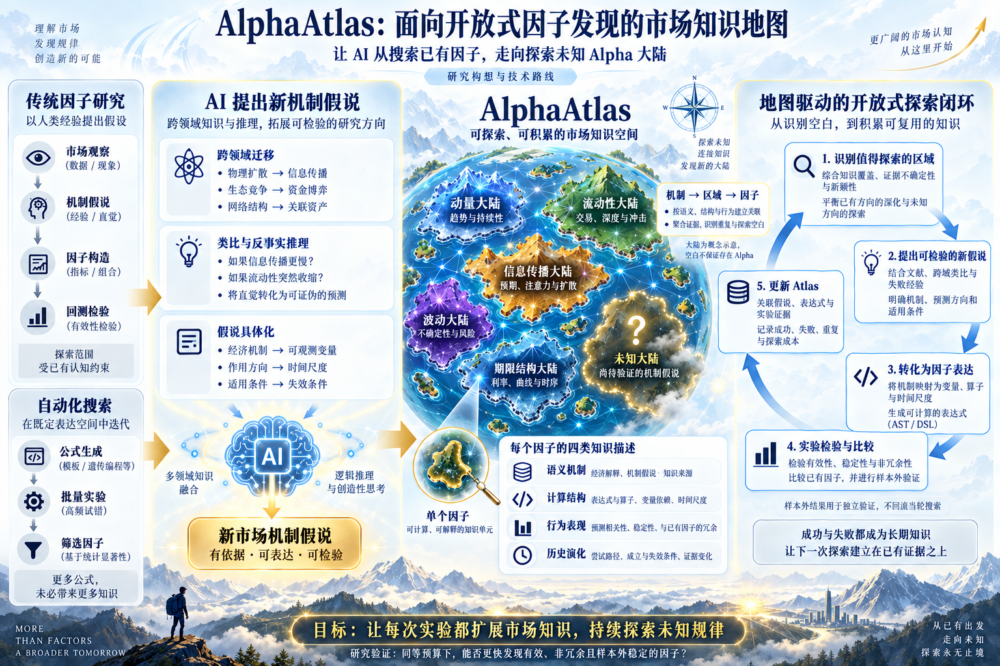
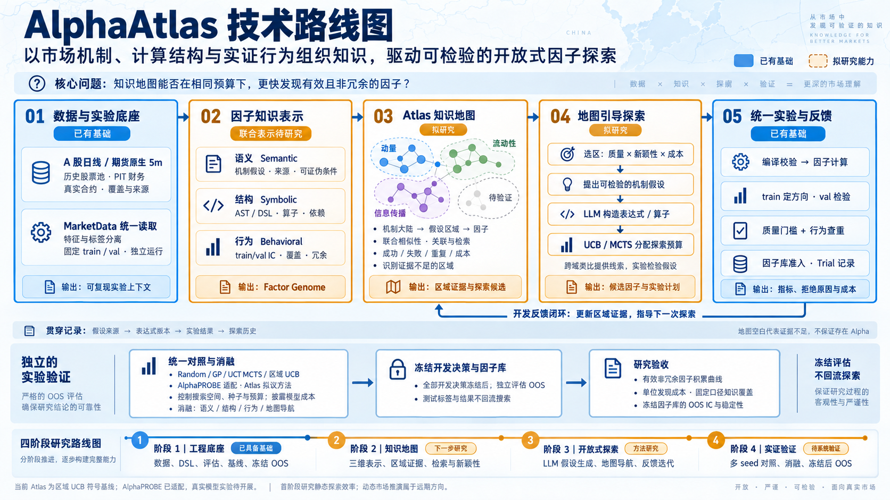

# AlphaAtlas 技术路线图

## 概念路线图 v2（按用户原图修订）

按用户要求保留原图的大陆地图、假说生成与五步探索闭环，去除工程架构和实施阶段。
仅细化机制到变量、算子与时间尺度的转化，以及因子知识描述和实验反馈。
此图表达研究构想，不表示所列能力均已实现；四类描述沿用原图，历史作为探索记录。
使用内置 image_gen，原图作为参考；完整提示词见
[v2 生成提示词](alpha-atlas-concept-roadmap-v2-prompt.txt)。

## 初版工程路线图（保留）

依据用户提供的概念图，以及项目 README、PLAN 和项目介绍整理，2026-09-10 生成。
使用内置 image_gen；完整提示词见 [生成提示词](alpha-atlas-roadmap-prompt.txt)。

路线分为数据与实验底座、因子知识表示、Atlas 知识地图、地图引导探索、统一实验与反馈。
蓝色表示已有工程基础，橙色表示拟研究能力；阶段顺序是建议推进路线，不是工期承诺。

因子以语义、结构、行为三个维度描述，探索历史作为贯穿记录。
首阶段在固定 train/val 下研究探索效率，动态市场状态与推演留作远期方向。
地图空白仅表示证据不足；类比、经济解释和模型生成的假设均须经过实验检验。
图中“质量 × 新颖性 × 成本”表示选区考虑的三个因素，不是已经定义的乘法奖励公式。

当前 Atlas 是区域 UCB 符号基线；联合表示、完整地图导航与开放式假设生成尚待研究。
AlphaPROBE 已有搜索算法适配及旧版模板初始化的真实运行；默认 LLM 冷启动版本尚待市场实验。
已有基础不表示已证明方法优势；下一步需开展多 seed 对照与消融。
比较需控制或明确披露搜索空间、初始条件、尝试预算与模型成本的差异。
知识覆盖采用独立于被比较方法的固定评价口径，不以新增区域数代表成功。

搜索反馈仅含开发期证据。全部开发决策与因子库冻结后才独立评价 OOS，结果不回流搜索。
两个既有 fold 的时间区间存在重叠，不作为相互独立的最终盲测。
主要验收指标是有效非冗余因子积累、单位发现成本、固定口径覆盖与冻结库 OOS IC；
IC 不等同于可交易收益。当前数据不能直接支持完整期限结构研究，需先补充相应数据。

本次仅新增路线图、提示词及说明，保留原有代码、文档和运行产物。
